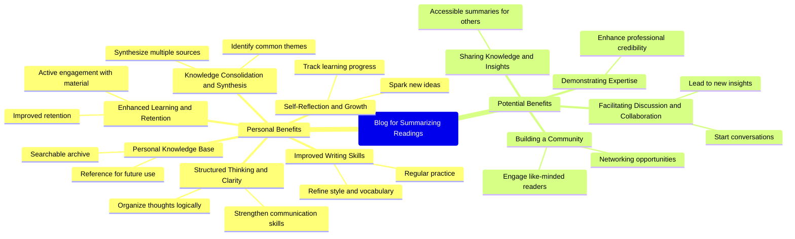

Creating a blog to summarize our readings offers several key benefits for others:

```mermaid
mindmap
  root(Blog for Summarizing Readings)
    Personal Benefits
      Enhanced Learning and Retention
        Active engagement with material
        Improved retention
      Structured Thinking and Clarity
        Organize thoughts logically
        Strengthen communication skills
      Knowledge Consolidation and Synthesis
        Synthesize multiple sources
        Identify common themes
      Personal Knowledge Base
        Searchable archive
        Reference for future use
      Improved Writing Skills
        Regular practice
        Refine style and vocabulary
      Self-Reflection and Growth
        Track learning progress
        Spark new ideas
    Potential Benefits
      Sharing Knowledge and Insights
        Accessible summaries for others
      Facilitating Discussion and Collaboration
        Start conversations
        Lead to new insights
      Building a Community
        Networking opportunities
        Engage like-minded readers
      Demonstrating Expertise
        Enhance professional credibility
```